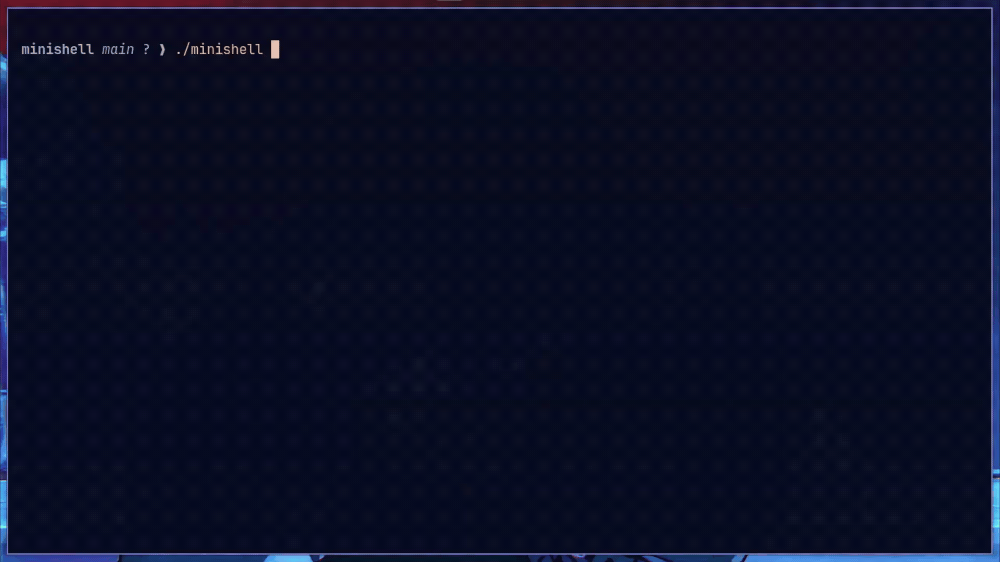

*This project has been created as part of the 42 curriculum by anashwan, masad*
# minishell
<div align="center">
  
</div>

## Description

minishell is a re-implementation of the fundamental functionality of `bash`. It's our deep dive into understanding the complete lifecycle of command-line interpretation — from reading user input and tokenizing it, through expansion and parsing, to executing different external and built-in processes, while managing file descriptors, signals, and the various edge cases a shell encounters in the wild.

At its core, it is a multi-stage pipeline where each component has a clear responsibility and a well-defined interface, yet all share the same state and cooperate to produce a single, cohesive program.

## Features

### Builtins

| Command | Description |
|---------|-------------|
| `echo` | Print text to stdout, supports `-n` flag |
| `cd` | Change working directory, updates `PWD` and `OLDPWD` |
| `pwd` | Print current working directory |
| `export` | Set or display environment variables |
| `unset` | Remove environment variables |
| `env` | Print all exported environment variables |
| `exit` | Exit the shell with an optional exit code |

### Operators

| Operator | Description |
|----------|-------------|
| `\|` | Pipe — connect stdout of one command to stdin of the next |
| `<` | Input redirection |
| `>` | Output redirection (overwrite) |
| `>>` | Output redirection (append) |
| `<<` | Heredoc — read input until delimiter is matched |

### Expansion

| Syntax | Description |
|--------|-------------|
| `$VAR` | Expand environment variable |
| `$?` | Expand last command's exit status |
| `$0` | Expands to `minishell` |
| `~` | Expands to `$HOME` |
| `'...'` | Single quotes — no expansion |
| `"..."` | Double quotes — variable expansion only |

### Signals

| Signal | Behavior |
|--------|----------|
| `Ctrl+C` | Interrupts current operation, prints new prompt |
| `Ctrl+\` | Ignored in interactive mode, quits running process otherwise |
| `Ctrl+D` | EOF — exits the shell gracefully |

## Implementation

### Overview


### Command Trace

The following diagram traces a real command through every stage of the shell:


### Data Structures

* **`t_string`** — Dynamic string with an internal index and capacity, used as a character-by-character scanner throughout tokenization, expansion, and heredoc reading
* **`t_token`** — Output unit of the tokenizer — carries the raw lexeme, its type, and a quoted flag
* **`t_env_var`** — A single environment variable as a key-value pair, stored in a linked list
* **`t_redir`** — A single redirection with its type, target, and an fd for heredocs filled at parse time
* **`t_cmd`** — Output unit of the parser — a list of arguments and a list of redirections
* **`t_shell`** — Top-level state container passed through every stage — environment, tokens, commands, pids, exit status, and control flags

### 1. Tokenization: Splitting the input into recognizable tokens

The tokenizer acts as a state machine, consuming the input line character by character and producing a flat list of `t_token` nodes. Each token carries a type, a lexeme, and a quoted flag.

**Token types:**
* **`WORD`** — A command name, argument, or redirection target
* **`PIPE`** — The `|` operator
* **`IN_RED`** — Input redirection `<`
* **`OUT_RED`** — Output redirection `>`
* **`APPEND`** — Append redirection `>>`
* **`HEREDOC`** — Heredoc operator `<<`
* **`AMBIG_REDIR`** — A redirection with an ambiguous target
* **`END`** — Terminal token marking the end of the list

**Scanners:**
Each character class is handled by a dedicated scanner, each with a single responsibility:
* **`scan_pipe`** — Recognizes the `|` operator
* **`scan_redirection`** — Recognizes `<`, `>`, `>>`, and `<<`
* **`scan_word`** — Reads a full word token, handles quoted mode and all expansion

The `t_string` struct is the shared interface across all scanners, wrapping a raw string with an internal index and exposing an `advance`/`peek` API so scanners consume characters without touching pointer arithmetic directly.

`scan_word` is the most involved scanner, handling normal mode, quoted mode, and driving the entire expansion process — `$VARIABLE`, `$?`, `$0`, and `~` are all resolved here before the token is finalized.

---

### 2. Expansion: Bridging static input with the dynamic state of the shell

The expander is triggered during tokenization whenever a `$` or `~` is encountered in a valid position. It looks up the variable name in the shell's environment list and appends its value to the current word being built. If the variable is not found, nothing is appended — consistent with standard shell behavior.

**Supported expansions:**
* **`$VARIABLE`** — Expands to the variable's value from the environment
* **`$?`** — Expands to the last command's exit status
* **`$0`** — Expands to `minishell`
* **`~`** — Expands to `$HOME`

Two important rules govern expansion behavior:
* **Field splitting** — if the expanded value contains spaces and the expansion is unquoted, the value is split into multiple tokens rather than treated as a single word
* **Quote context** — single quotes suppress expansion entirely, double quotes allow only `$` expansion, `~` expansion is suppressed inside any quotes

---

### 3. Parser: Giving the input it's context

The parser walks the token list produced by the tokenizer and has two responsibilities: validating syntax and constructing the command list.

**Syntax validation:** The parser catches and reports errors before any command is built:
* **Invalid Pipes** — Pipe without a preceding or following command (e.g., `| ls` or `ls |`)
* **Missing Targets** — Redirection without a target (e.g., `ls >` or `< >`)

**Command construction** — for each command segment between pipes, the parser creates a `t_cmd` node populated with two lists: the argument list built from `WORD` tokens, and the redirection list built from redirection tokens and their targets.

**Heredoc handling** — when the parser encounters a `HEREDOC` redirection, it immediately creates a pipe and reads input line by line until the delimiter is matched, writing each line into the pipe's write end. The read end is stored directly in the redirection struct and consumed at execution time when redirections are applied. If multiple heredocs appear in the same command, only the last one is kept — previous file descriptors are closed. Expansion inside the heredoc content follows the delimiter's quote context: an unquoted delimiter allows `$` expansion, a quoted one treats the content as entirely literal.

---

### 4. Execution: Bringing the command list to action

The executor receives the finalized command list and dispatches execution through one of two paths:
* **Direct Builtins** — A single builtin command runs directly in the parent process — this is what allows `cd`, `export`, and `unset` to affect the shell's own state.
* **Pipeline Execution** — All other cases go through the pipeline, regardless of whether it's a single command or a chain.

**Pipeline** — for each command, a child process is forked, pipes are created and chained, and the read end of the previous pipe is passed as stdin to the next child. Each child calls `run_child`.

**`run_child`** — wires up file descriptors via `dup2`, applies the command's redirections, closes any remaining heredoc fds, then hands off to `execute_command`.

**`execute_command`** — runs builtins in the child when inside a pipeline, then resolves external commands in one of two ways:
* If the command contains a `/`, it is treated as a path and executed directly after permission and existence checks.
* Otherwise, it is searched across each directory in `PATH` and executed if found.

Exit codes follow standard convention: `126` for permission or directory errors, `127` for command not found, and `128 + signal` for signal termination.

## Instructions

### Dependencies

The following libraries are required to compile minishell:

- `readline` — for input and history
- `ncurses` — required by readline on some systems

On Ubuntu/Debian:
```bash
sudo apt-get install libreadline-dev libncurses-dev
```

### Compilation

```bash
git clone https://github.com/ahmad-nashwan/minishell.git
cd minishell
make
```

To clean object files:
```bash
make clean
```

To remove everything including the binary:
```bash
make fclean
```

### Running

```bash
./minishell
```

## Resources

| Type | Resource |
|------|----------|
| Article | [Minishell: Building a mini-bash — MannBell](https://m4nnb3ll.medium.com/minishell-building-a-mini-bash-a-42-project-b55a10598218) |
| Book | [Crafting Interpreters — Scanning](https://craftinginterpreters.com/scanning.html) |
| Article | [Bash Heredoc — Linuxize](https://linuxize.com/post/bash-heredoc/) |
| Man page | `man 2 pipe` |
| Video | [dup2 in C](https://www.youtube.com/watch?v=5fnVr-zH-SE) |
| Video | [fork in C](https://www.youtube.com/watch?v=cex9XrZCU14) |
| Video | [waitpid](https://www.youtube.com/watch?v=tcYo6hipaSA) |
| Video | [wait and waitpid](https://www.youtube.com/watch?v=kCGaRdArSnA) |
| Reference | [Bash manual](https://www.gnu.org/software/bash/manual/bash.html) — the ultimate reference |

### AI Usage

AI was used for planning, clarifying concepts, and debugging errors. It was not used to generate source code.
